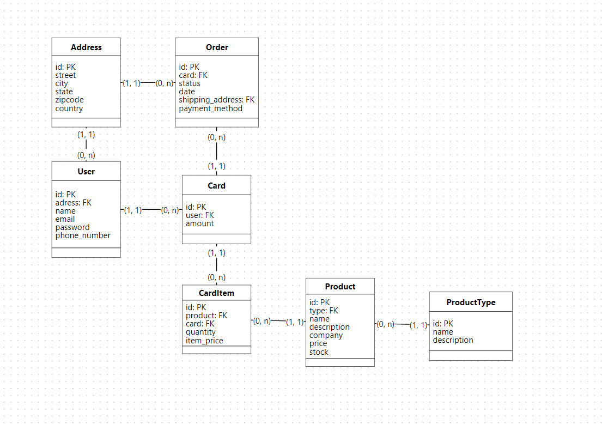

# Stripe Integration on Laravel
This is a _Laravel_ API with integration with _Google Auth_ and _Stripe_ (web financial solution), its goal is to be a eccomerce api, where is possible to add products in a Card and buy them, all the payment process is going to be handled with Stripe.
The API was write with _SOLID_ principles and has _PostgreSQL_ as its database.

##### **I've created a logical databse model of this project, take a look:**

# Running project
You can run the project in two ways:

1. **Docker:**

2. **Laravel Artisan:** 
The only thing that you gonna have to do is to add your `.env` with the credencials of the database you want to use for example:

### That's it, thanks for the support!
