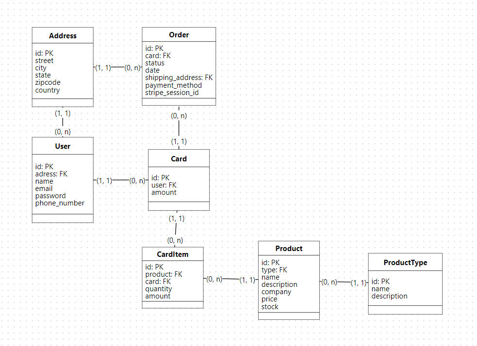

# Stripe Integration on Laravel
This is a Laravel API integrated with Google Auth and Stripe (for web financial solutions), designed as an e-commerce API that allows users to add products to a cart and purchase them, with all payment processes handled by Stripe. The API is built using SOLID principles and PostgreSQL as its database. The project uses JWT for authentication, Stripe webhooks for payment processing, email sending for notifications, TDD for test-driven development, and includes end-to-end tests. Additionally, Scribe is used to save and manage the API documentation.

##### **I've created a logical databse model of this project, take a look:**


# Running project with Laravel Artisan:

- First thing that you gonna have to do is to add your `.env` with the credencials of the database you want to use for example:


- Then run `php artisan migrate` to run all the necessary database structure for the project.

- After that run `php artisan serve` and you're good to go.

### That's it, below you can see the API reference documentation!


## Authentication and User Management

1. **POST `/api/auth`** 
   - **Description**: User authentication.
   - **Request Body**:
     ```json
     {
       "email": "string",
       "password": "string"
     }
     ```

2. **GET `/api/google/oauth`** 
   - **Description**: Initiate Google OAuth.
   - **Request Body**: Not required.

3. **GET `/api/google/oauth/callback`** 
   - **Description**: Handle Google OAuth callback.
   - **Request Body**: Not required.

4. **POST `/api/user/register`** 
   - **Description**: Register a new user.
   - **Request Body**:
     ```json
     {
       "name": "string",
       "email": "string",
       "phone_number": "string",
       "password": "string"
     }
     ```

5. **POST `/api/user/mail/change/password`** 
   - **Description**: Change password via email.
   - **Request Body**:
     ```json
     {
       "email": "string"
     }
     ```

6. **GET `/api/user/check/token`** 
   - **Description**: Check if a token is valid.
   - **Request Body**:
     ```json
     {
       "token": "string"
     }
     ```

7. **POST `/api/user/change/password`** 
   - **Description**: Change user password.
   - **Request Body**:
     ```json
     {
       "token": "string",
       "new_password": "string"
     }
     ```

8. **PUT `/api/user/update`** 
   - **Description**: Update user information.
   - **Request Body**:
     ```json
     {
       "id": "integer",
       "name": "string",
       "email": "string",
       "phone_number": "string"
     }
     ```

9. **GET `/api/user/find`** 
   - **Description**: Find user by ID.
   - **Request Body**:
     ```json
     {
       "id_user": "integer"
     }
     ```

10. **DELETE `/api/user/delete`** 
    - **Description**: Delete a user.
    - **Request Body**:
      ```json
      {
        "id_user": "integer"
      }
      ```

## Address Management

11. **POST `/api/user/address/add`** 
    - **Description**: Add a user address.
    - **Request Body**:
      ```json
      {
        "id_user": "integer",
        "street": "string",
        "city": "string",
        "state": "string",
        "zip_code": "string",
        "country": "string"
      }
      ```

12. **PATCH `/api/user/address/switch`** 
    - **Description**: Switch user address.
    - **Request Body**:
      ```json
      {
        "id_user": "integer",
        "id_address": "integer"
      }
      ```

13. **PUT `/api/user/address/update`** 
    - **Description**: Update a user's address.
    - **Request Body**:
      ```json
      {
        "id_address": "integer",
        "street": "string",
        "city": "string",
        "state": "string",
        "zip_code": "string",
        "country": "string"
      }
      ```

14. **GET `/api/user/address/find`** 
    - **Description**: Find user address.
    - **Request Body**:
      ```json
      {
        "id_address": "integer"
      }
      ```

15. **DELETE `/api/user/address/remove`** 
    - **Description**: Remove a user address.
    - **Request Body**:
      ```json
      {
        "id_address": "integer"
      }
      ```

## Product Management

16. **POST `/api/product/type/register`** 
    - **Description**: Register a new product type.
    - **Request Body**:
      ```json
      {
        "name": "string",
        "description": "string"
      }
      ```

17. **PUT `/api/product/type/update`** 
    - **Description**: Update a product type.
    - **Request Body**:
      ```json
      {
        "id_type": "integer",
        "name": "string",
        "description": "string"
      }
      ```

18. **POST `/api/product/register`** 
    - **Description**: Register a new product.
    - **Request Body**:
      ```json
      {
        "name": "string",
        "price": "decimal",
        "company": "string",
        "type_id": "integer",
        "desc": "string",
        "stock": "integer"
      }
      ```

19. **PUT `/api/product/update`** 
    - **Description**: Update a product.
    - **Request Body**:
      ```json
      {
        "id_product": "integer",
        "name": "string",
        "price": "decimal",
        "company": "string",
        "type_id": "integer",
        "desc": "string",
        "stock": "integer"
      }
      ```

## Card Management

20. **POST `/api/card/register`** 
    - **Description**: Register a new card for the user.
    - **Request Body**:
      ```json
      {
        "id_user": "integer"
      }
      ```

21. **DELETE `/api/card/delete`** 
    - **Description**: Delete a card.
    - **Request Body**:
      ```json
      {
        "card_id": "integer"
      }
      ```

22. **GET `/api/card/user`** 
    - **Description**: List cards for a user.
    - **Request Body**: Not required.

## Product Type and Product Retrieval

23. **GET `/api/product/type/index`** 
    - **Description**: List all product types.
    - **Request Body**: Not required.

24. **GET `/api/product/index`** 
    - **Description**: List all products.
    - **Request Body**: Not required.

25. **GET `/api/product/find`** 
    - **Description**: Find a product by ID.
    - **Request Body**:
      ```json
      {
        "id": "integer"
      }
      ```
